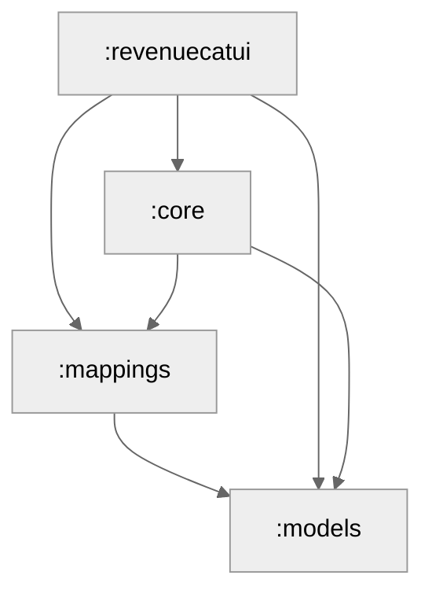

## :core module dependency graph

```mermaid
%%{
  init: {
    'theme': 'neutral'
  }
}%%
graph TB
    :mappings --> :models
    :revenuecatui --> :mappings
    :revenuecatui --> :core
    :revenuecatui --> :models
    :core --> :models
    :core --> :mappings
```
