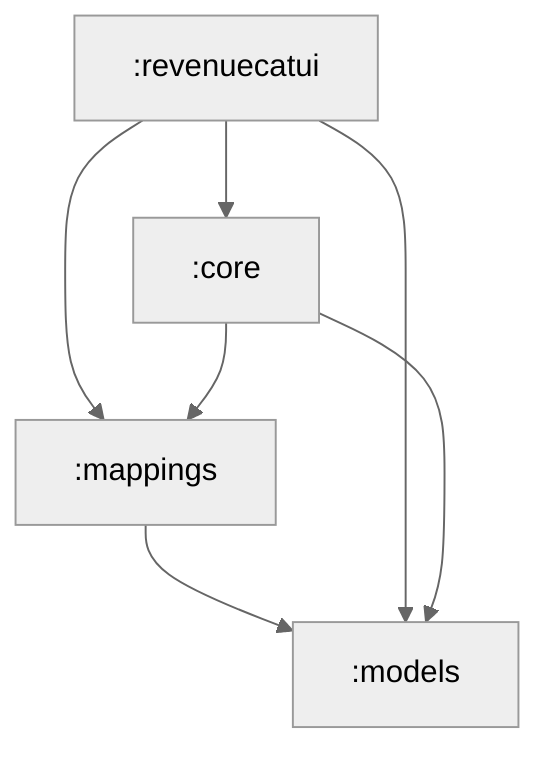

## :revenuecatui module dependency graph

```mermaid
%%{
  init: {
    'theme': 'neutral'
  }
}%%

graph TB
  :mappings --> :models
  :revenuecatui --> :core
  :revenuecatui --> :models
  :revenuecatui --> :mappings
  :core --> :models
  :core --> :mappings
```